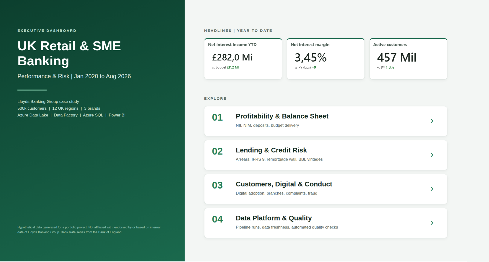
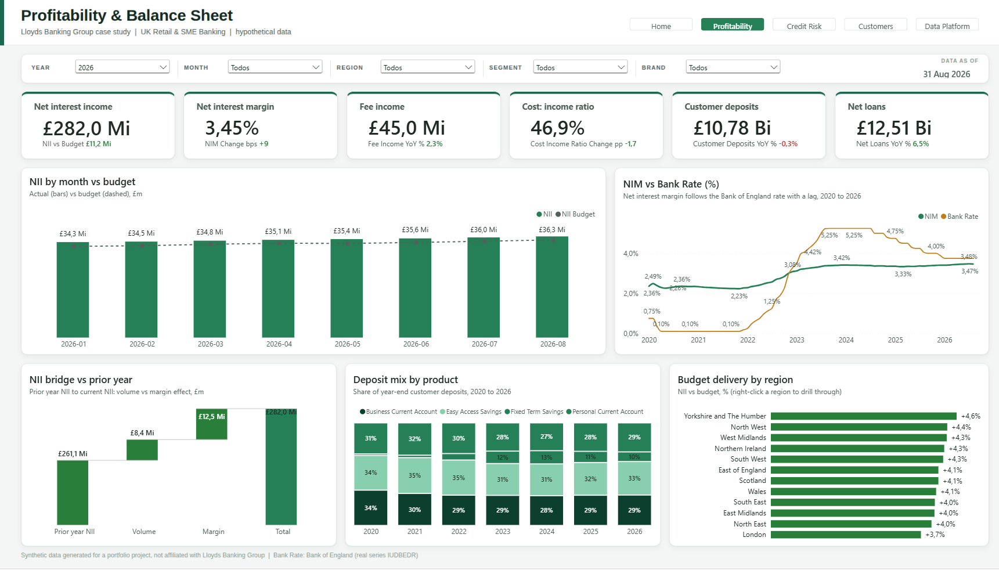
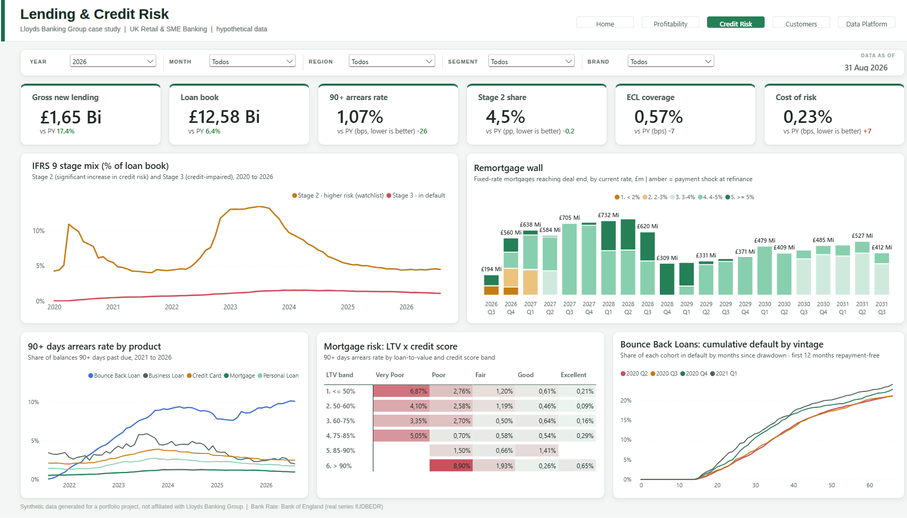
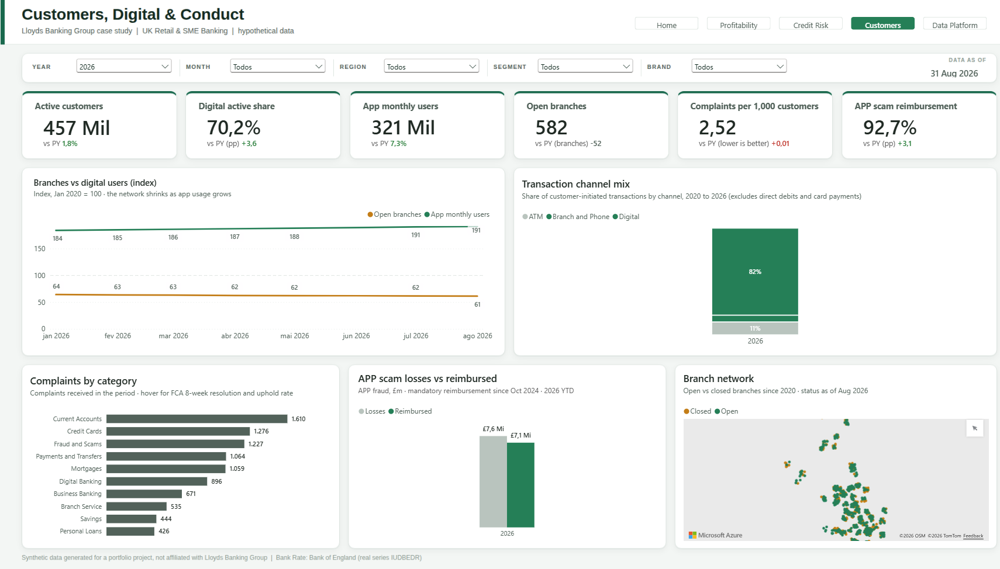
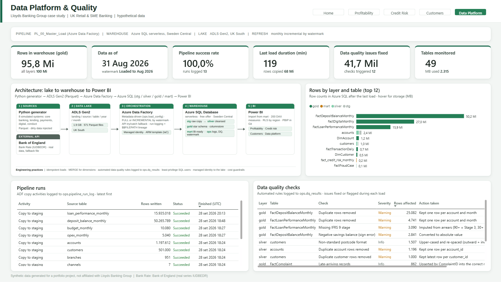
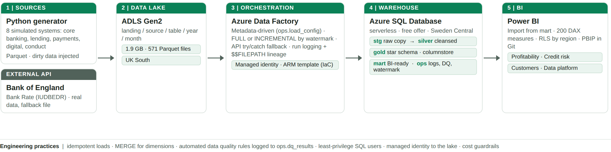

# UK Retail & SME Banking | Azure Data Pipeline + Power BI Executive Dashboard

> **Case study: Lloyds Banking Group.** All data is **synthetic and hypothetical**, generated for portfolio purposes only.
> This project is not affiliated with, endorsed by or based on internal data of Lloyds Banking Group.

End-to-end analytics solution for a UK retail and SME bank: from simulated source systems to a cloud data lake,
a metadata-driven Azure Data Factory pipeline, a layered Azure SQL warehouse and an executive Power BI dashboard.

**[▶ Open the live Power BI dashboard](https://app.powerbi.com/view?r=eyJrIjoiNzM3OGZhZjQtOTk0Yy00NzNiLWE2MDktYTE5OTk2MGU3YmM1IiwidCI6ImRlODdjNWRjLTBhMzctNDVlMi1hNzhhLTM3NDg0ODE0MDNiZiJ9)** (public, no login needed)



## At a glance

| | |
|---|---|
| **Customers** | ~500,000 (Personal + SME) across 12 UK regions and 3 brands |
| **History** | Jan 2020 to Aug 2026 (80 months) actuals, budget to Dec 2026 |
| **Volume** | ~96 million rows, 18 source tables, 1.9 GB Parquet |
| **Stack** | Python, Azure Data Lake Gen2, Azure Data Factory, Azure SQL Database, T-SQL, Power BI, DAX |
| **External data** | Real Bank of England Bank Rate (series IUDBEDR) via the public IADB API |

## Business questions the dashboard answers

1. **Profitability** | How do Net Interest Income and NIM respond to the Bank Rate cycle (0.10% in 2020, 5.25% in 2023, 3.75% in 2026)? Are we ahead of budget?
2. **Balance sheet** | How much deposit balance migrated from current accounts to fixed term savings when rates rose?
3. **Credit risk** | Where are arrears and IFRS 9 Stage 2 balances building up? What happened when low-rate mortgage fixes matured (the "remortgage wall")?
4. **Government schemes** | How did COVID payment holidays and Bounce Back Loans perform by vintage?
5. **Customers and conduct** | Branch closures vs digital adoption, complaints handled within the FCA 8-week rule, APP fraud reimbursement after the October 2024 PSR rule.

## Dashboard

Five pages, built for an executive audience (pages 1 to 3) and a technical audience (page 4). **[Live report](https://app.powerbi.com/view?r=eyJrIjoiNzM3OGZhZjQtOTk0Yy00NzNiLWE2MDktYTE5OTk2MGU3YmM1IiwidCI6ImRlODdjNWRjLTBhMzctNDVlMi1hNzhhLTM3NDg0ODE0MDNiZiJ9)**

| Page | What it shows |
|---|---|
| **Home** | Year-to-date headlines and navigation |
| **Profitability** | NII vs budget, NIM vs Bank Rate, NII bridge (volume vs margin), deposit mix, budget delivery by region |
| **Credit Risk** | IFRS 9 Stage 2 / 3 trend, remortgage wall and payment shock, 90+ arrears by product, LTV x credit score heatmap, Bounce Back Loan vintages |
| **Customers** | Branches vs app users (index), channel mix, complaints (FCA 8-week rule), APP scam reimbursement after the PSR rule |
| **Data Platform** | Architecture, rows by layer, pipeline run log, automated data quality checks |






## Architecture



| Layer | Technology | Highlights |
|---|---|---|
| Source | Python (`generator/`) | 8 simulated source systems, realistic UK banking dynamics, **data quality issues injected on purpose** |
| Lake | ADLS Gen2 (`landing` container) | Parquet partitioned by `source/table/year=YYYY/month=MM` |
| Orchestration | Azure Data Factory (`adf/`) | **Metadata-driven** (one config table drives all loads), FULL or INCREMENTAL (watermark) mode, try/catch API fallback, run logging and file lineage, **managed identity** (no keys), deployed as **ARM template (IaC)** |
| Warehouse | Azure SQL Database (`sql/`) | `stg` > `silver` > `gold` (Kimball star schema, columnstore) > `mart`, plus `ops` (logs, watermarks, data quality results) |
| BI | Power BI (`powerbi/`) | Import from `mart`, ~200 DAX measures in display folders, PBIP format (model and report as code), published with Publish to web |

### Data model (gold)

- **Dimensions:** Date (UK bank holidays), Region, Product, Channel, Branch, Customer, Account, Complaint Category
- **Facts:** Deposit balances (monthly, ~50M rows), Loan performance with IFRS 9 staging, PD, LGD, EAD, ECL (~16M), Digital activity (~27M), Daily transactions, Branch activity, Complaints, Fraud cases, Budget, Opex, Bank Rate (daily)
- **Net Interest Income on a Funds Transfer Pricing (FTP) basis:** deposits earn an FTP credit (structural hedge yield / Bank Rate / swap), loans pay an FTP charge, the way UK banks measure product profitability

### Data quality (automated, logged to `ops.dq_results`)

| Issue injected in source | Rule applied |
|---|---|
| Duplicate customers, accounts and monthly rows | Deduplicated by business key |
| Missing region code | Derived from a postcode area to region map learned from the data |
| Non-standard postcodes (`ne127ab`) | Standardised to UK format (`NE12 7AB`) |
| Onboarding dates in the future | Set to NULL and flagged |
| Negative savings balances (sign error) | Converted to absolute value |
| Missing IFRS 9 stage | Imputed from arrears (90+ DPD = Stage 3, 30+ = Stage 2) |
| Lower-case region codes in transactions | Upper-cased and re-aggregated |
| Complaints resolved before received / late-arriving files | Date removed and flagged / upserted into the right period |

### Cost and security

- Runs on **Azure free tiers**: Azure SQL Database free offer (serverless, auto-pause when the monthly free limit is reached), storage in LRS, Data Factory trigger deployed **stopped**, budget alert on the subscription.
- **Least privilege:** `etl_loader` (pipeline) and `pbi_reader` (Power BI, read-only) database users; the admin account is never used by tools.
- Data Factory reads the lake with its **system-assigned managed identity** (Storage Blob Data Reader), no storage keys stored.

## Repository structure

```
generator/   Python data generator + validation report
upload/      Idempotent upload of the Parquet files to the data lake
sql/         01 schemas and security | 02 staging | 03 gold star schema | 04 load config | 05 load procedures | 06 marts
adf/         Data Factory ARM template (+ Python builder)
powerbi/     Power BI project (PBIP), theme and page backgrounds
docs/        Architecture diagram and screenshots
```

## How to reproduce

1. `python generator/generate_lloyds_data.py` (use `--scale 0.01` for a quick test) and `python generator/validate_data.py`
2. Create an ADLS Gen2 storage account with a `landing` container, then `python upload/upload_to_blob.py`
3. Create an Azure SQL Database and run `sql/01` to `sql/06` in order
4. Deploy `adf/adf_lloyds_template.json` (Custom deployment in the Azure portal) and trigger `PL_00_Master_Load` with `p_load_mode = FULL`
5. Open `powerbi/LloydsDashboard.pbip` in Power BI Desktop and point the source to your Azure SQL database (read-only user `pbi_reader`)

## Author

**João Paúra** | Senior Data Analyst and BI Specialist
[GitHub](https://github.com/joaopaura)
